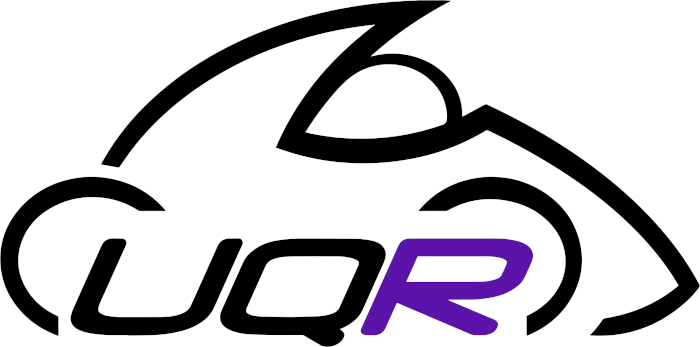

# UQ Racing
Welcome to the GitHub organisation for the UQ Racing Formula SAE Team. This organisation holds the code we have developed
for our electric and autonomous vehicles.

For more information, please visit: https://www.uqracing.com/

For questions relating to this GitHub or our code in general, please contact our Software Lead: Ethan Ney (software@uqracing.com)

## It's empty here!
Internally, we have more than 30 repositories covering topics from ROS, to simulators, to firmware for various microcontrollers.
We are currently working out which repositories we can release open source, and how best to do so. Hopefully in the near
future we can release quite a lot of our code to the wider community. So stay tuned!
